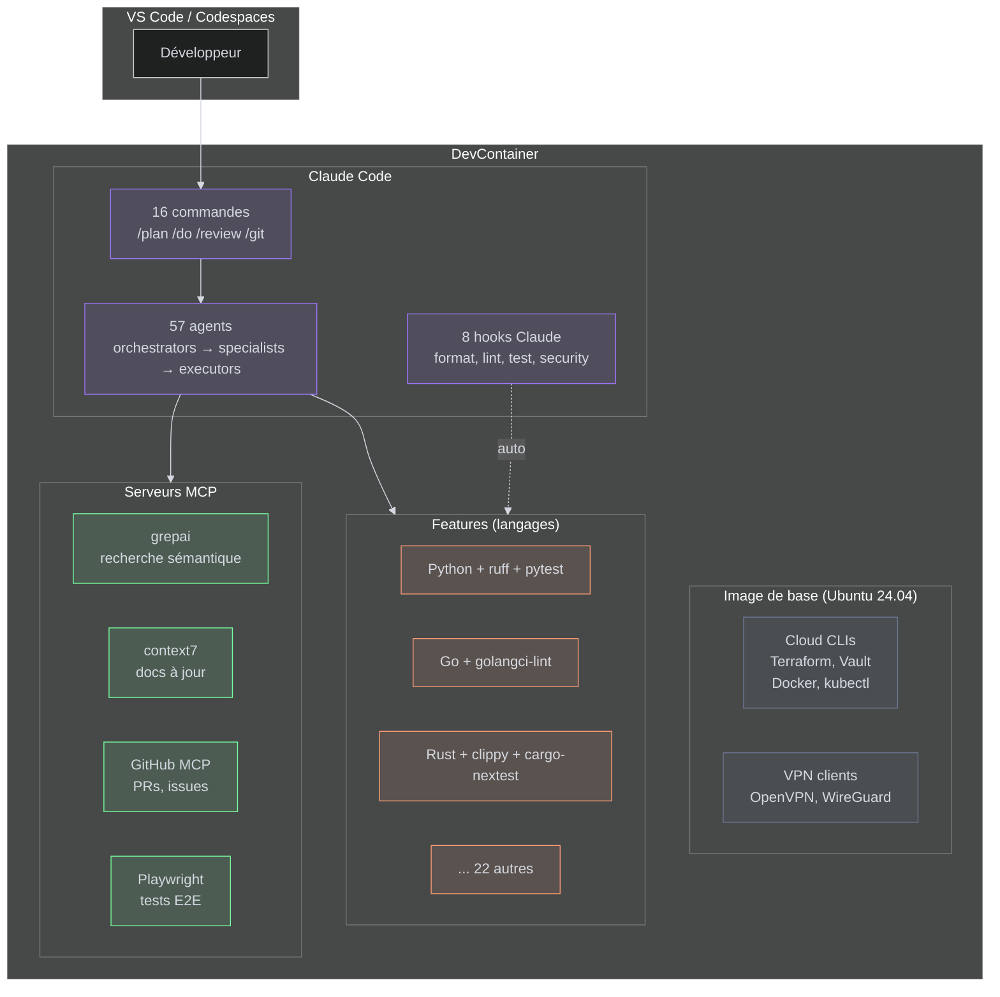
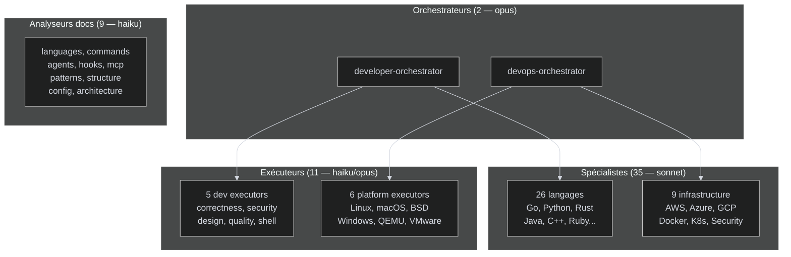

# Architecture

## Vue d'ensemble

Le DevContainer Template est organisé en 4 couches : l'image Docker de base, les features de langages, la configuration Claude Code, et les hooks d'automatisation.



## Structure des fichiers

```
.devcontainer/
├── devcontainer.json          # Point d'entrée VS Code
├── docker-compose.yml         # Service + 8 volumes
├── Dockerfile                 # Étend l'image de base
├── .env.tpl                   # Template des variables d'env
├── features/
│   └── languages/             # 25 installeurs (1 par langage)
│       ├── shared/            # feature-utils.sh (utilitaires partagés)
│       ├── go/install.sh
│       ├── python/install.sh
│       └── ...
├── hooks/
│   └── lifecycle/             # Stubs de délégation
│       ├── initialize.sh      # → host (Ollama, .env)
│       ├── postCreate.sh      # → /etc/devcontainer-hooks/
│       └── postStart.sh       # → /etc/devcontainer-hooks/
└── images/
    ├── Dockerfile             # Image de base (Ubuntu + outils)
    ├── mcp.json.tpl           # Template MCP (tokens injectés)
    ├── grepai.config.yaml     # Config recherche sémantique
    ├── hooks/                 # Vrais hooks (embarqués dans l'image)
    │   ├── shared/utils.sh    # 367 lignes d'utilitaires
    │   └── lifecycle/         # onCreate, postCreate, postStart
    └── .claude/
        ├── commands/          # 16 commandes (markdown)
        ├── agents/            # 57 agents (markdown)
        ├── scripts/           # 15 scripts hooks Claude
        ├── docs/              # 162 patterns de design
        └── settings.json      # Config Claude Code
```

## Système d'agents

57 agents organisés en hiérarchie à 3 niveaux :



| Niveau | Nombre | Modèle | Rôle |
|--------|--------|--------|------|
| Orchestrateur | 2 | Opus | Décompose la tâche, coordonne les sous-agents |
| Spécialiste | 35 | Sonnet | Expertise dans un langage ou domaine infra |
| Exécuteur | 11 | Haiku/Opus | Analyse ciblée (sécurité, qualité, correctness) |
| Analyseur docs | 9 | Haiku/Sonnet | Analyse du codebase pour `/docs` |

**Comment c'est utilisé** : quand vous tapez `/review`, le `developer-specialist-review` lance 5 exécuteurs en parallèle. Quand vous tapez `/plan`, l'orchestrateur consulte le spécialiste du langage détecté et les patterns dans `~/.claude/docs/`.

## Pattern de délégation des hooks

Les hooks de cycle de vie utilisent un pattern à deux couches :

1. **Stubs workspace** (`.devcontainer/hooks/lifecycle/`) : scripts courts qui délèguent
2. **Hooks image** (`/etc/devcontainer-hooks/lifecycle/`) : vrais scripts embarqués dans le Docker

Avantage : les hooks se mettent à jour automatiquement quand l'image est reconstruite, sans modifier le workspace.

```bash
# Exemple de stub (postStart.sh dans le workspace)
#!/bin/bash
exec /etc/devcontainer-hooks/lifecycle/postStart.sh "$@"
```

## Restauration au démarrage

`postStart.sh` restaure les fichiers Claude depuis `/etc/claude-defaults/` à chaque démarrage. Ce mécanisme garantit que les commandes, agents et scripts sont toujours à jour avec l'image, même si le volume `~/.claude` contient d'anciennes versions.

Fichiers restaurés :
- `~/.claude/commands/` (16 commandes)
- `~/.claude/scripts/` (15 scripts hooks)
- `~/.claude/agents/` (57 agents)
- `~/.claude/docs/` (162 patterns)
