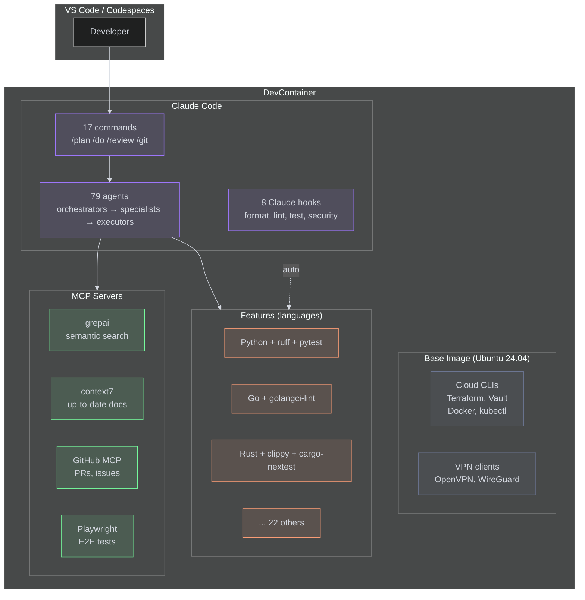
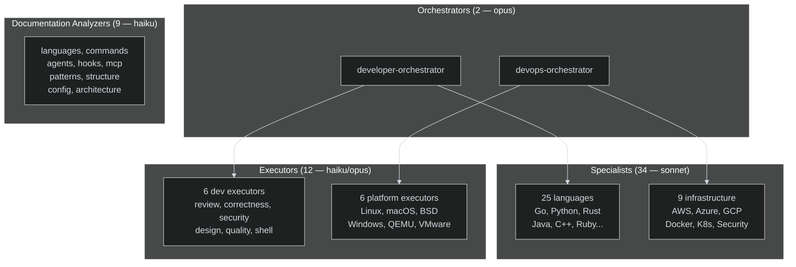

# Architecture

## Overview

The DevContainer Template is organized in 4 layers: the base Docker image, language features, Claude Code configuration, and automation hooks.


```mermaid
%%{init: {'theme': 'dark', 'themeVariables': {
  'primaryColor': '#9D76FB1a',
  'primaryBorderColor': '#9D76FB',
  'primaryTextColor': '#d4d8e0',
  'lineColor': '#d4d8e0',
  'textColor': '#d4d8e0',
  'secondaryColor': '#76FB9D1a',
  'secondaryBorderColor': '#76FB9D',
  'secondaryTextColor': '#d4d8e0',
  'tertiaryColor': '#FB9D761a',
  'tertiaryBorderColor': '#FB9D76',
  'tertiaryTextColor': '#d4d8e0'
}}}%%
flowchart TB
    subgraph IDE["VS Code / Codespaces"]
        U[Developer]
    end

    subgraph DC["DevContainer"]
        subgraph BASE["Base Image (Ubuntu 24.04)"]
            TOOLS[Cloud CLIs<br/>Terraform, Vault<br/>Docker, kubectl]
            NET[VPN clients<br/>OpenVPN, WireGuard]
        end

        subgraph FEAT["Features (languages)"]
            L1[Python + ruff + pytest]
            L2[Go + golangci-lint]
            L3[Rust + clippy + cargo-nextest]
            LN[... 22 others]
        end

        subgraph CLAUDE["Claude Code"]
            CMD[17 commands<br/>/plan /do /review /git]
            AGT[79 agents<br/>orchestrators → specialists → executors]
            HK[8 Claude hooks<br/>format, lint, test, security]
        end

        subgraph MCP["MCP Servers"]
            G[grepai<br/>semantic search]
            C7[context7<br/>up-to-date docs]
            GH[GitHub MCP<br/>PRs, issues]
            PW[Playwright<br/>E2E tests]
        end
    end

    U --> CMD
    CMD --> AGT
    AGT --> MCP
    HK -.->|auto| FEAT
    AGT --> FEAT

    classDef primary fill:#9D76FB1a,stroke:#9D76FB,color:#d4d8e0
    classDef data fill:#76FB9D1a,stroke:#76FB9D,color:#d4d8e0
    classDef async fill:#FB9D761a,stroke:#FB9D76,color:#d4d8e0
    classDef external fill:#6c76931a,stroke:#6c7693,color:#d4d8e0

    class CMD,AGT,HK primary
    class G,C7,GH,PW data
    class L1,L2,L3,LN async
    class TOOLS,NET external
```

## File Structure

```
.devcontainer/
├── devcontainer.json          # VS Code entry point
├── docker-compose.yml         # Service + 8 volumes
├── Dockerfile                 # Extends the base image
├── .env.tpl                   # Environment variables template
├── features/
│   └── languages/             # 25 installers (1 per language)
│       ├── shared/            # feature-utils.sh (shared utilities)
│       ├── go/install.sh
│       ├── python/install.sh
│       └── ...
├── hooks/
│   └── lifecycle/             # Host-side only
│       └── initialize.sh      # → host (Ollama, .env)
└── images/
    ├── Dockerfile.base        # Stable layer (apt, Cloud CLIs) — weekly
    ├── Dockerfile             # Dynamic layer (Claude, tools) — daily
    ├── mcp.json.tpl           # MCP template (tokens injected)
    ├── grepai.config.yaml     # Semantic search config
    ├── hooks/                 # Real hooks (embedded in image)
    │   ├── shared/utils.sh    # 367 lines of utilities
    │   └── lifecycle/         # onCreate, postCreate, postStart
    └── .claude/
        ├── commands/          # 17 commands (markdown)
        ├── agents/            # 79 agents (markdown)
        ├── scripts/           # 31 Claude hook scripts
        ├── docs/              # 170+ design patterns
        └── settings.json      # Claude Code config
```

## Agent System

79 agents organized in a 3-level hierarchy:


```mermaid
%%{init: {'theme': 'dark', 'themeVariables': {
  'primaryColor': '#9D76FB1a',
  'primaryBorderColor': '#9D76FB',
  'primaryTextColor': '#d4d8e0',
  'lineColor': '#d4d8e0',
  'textColor': '#d4d8e0'
}}}%%
flowchart TD
    subgraph ORCH["Orchestrators (2 — opus)"]
        DO[developer-orchestrator]
        OO[devops-orchestrator]
    end

    subgraph SPEC["Specialists (34 — sonnet)"]
        LS[25 languages<br/>Go, Python, Rust<br/>Java, C++, Ruby...]
        IS[9 infrastructure<br/>AWS, Azure, GCP<br/>Docker, K8s, Security]
    end

    subgraph EXEC["Executors (12 — haiku/opus)"]
        DE[6 dev executors<br/>review, correctness, security<br/>design, quality, shell]
        PE[6 platform executors<br/>Linux, macOS, BSD<br/>Windows, QEMU, VMware]
    end

    subgraph DOCS["Documentation Analyzers (9 — haiku)"]
        DA[languages, commands<br/>agents, hooks, mcp<br/>patterns, structure<br/>config, architecture]
    end

    DO --> LS
    DO --> DE
    OO --> IS
    OO --> PE
```

| Level | Count | Model | Role |
|-------|-------|-------|------|
| Orchestrator | 2 | Opus | Decomposes the task, coordinates sub-agents |
| Specialist | 34 | Sonnet | Expertise in a language or infrastructure domain |
| Executor | 12 | Haiku/Opus | Targeted analysis (security, quality, correctness) |
| Documentation Analyzer | 9 | Haiku/Sonnet | Codebase analysis for `/docs` |

**How it's used**: when you type `/review`, the `developer-specialist-review` launches 5 executors in parallel. When you type `/plan`, the orchestrator consults the detected language specialist and the patterns in `~/.claude/docs/`.

## Lifecycle Hooks

Lifecycle hooks are embedded in the Docker image at `/etc/devcontainer-hooks/lifecycle/`.
`devcontainer.json` calls them directly — no workspace stubs needed.

Advantage: hooks update automatically when the image is rebuilt.

```json
// devcontainer.json
"postStartCommand": "/etc/devcontainer-hooks/lifecycle/postStart.sh"
```

Only exception: `initialize.sh` runs on the host (before container build).

## Startup Restoration

`postStart.sh` restores Claude files from `/etc/claude-defaults/` at each startup. This mechanism ensures that commands, agents and scripts are always up to date with the image, even if the `~/.claude` volume contains older versions.

Restored files:
- `~/.claude/commands/` (17 commands)
- `~/.claude/scripts/` (31 hook scripts)
- `~/.claude/agents/` (79 agents)
- `~/.claude/docs/` (170+ patterns)
