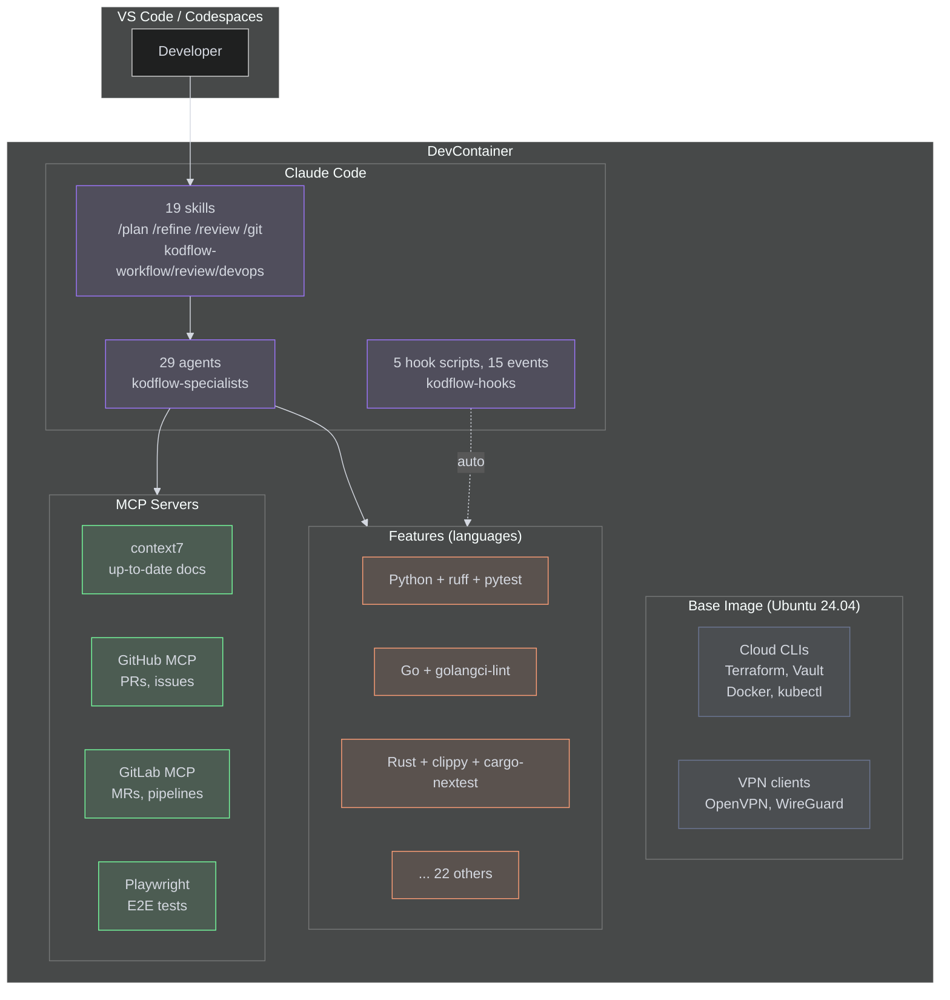
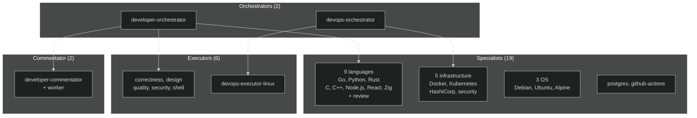

# Architecture

## Overview

The DevContainer Template is organized in 4 layers: the base Docker image, language features, Claude Code configuration, and the kodflow marketplace plugins (skills, agents, hooks).


```mermaid
%%{init: {'theme': 'dark', 'themeVariables': {
  'primaryColor': '#9D76FB1a',
  'primaryBorderColor': '#9D76FB',
  'primaryTextColor': '#d4d8e0',
  'lineColor': '#d4d8e0',
  'textColor': '#d4d8e0',
  'secondaryColor': '#76FB9D1a',
  'secondaryBorderColor': '#76FB9D',
  'secondaryTextColor': '#d4d8e0',
  'tertiaryColor': '#FB9D761a',
  'tertiaryBorderColor': '#FB9D76',
  'tertiaryTextColor': '#d4d8e0'
}}}%%
flowchart TB
    subgraph IDE["VS Code / Codespaces"]
        U[Developer]
    end

    subgraph DC["DevContainer"]
        subgraph BASE["Base Image (Ubuntu 24.04)"]
            TOOLS[Cloud CLIs<br/>Terraform, Vault<br/>Docker, kubectl]
            NET[VPN clients<br/>OpenVPN, WireGuard]
        end

        subgraph FEAT["Features (languages)"]
            L1[Python + ruff + pytest]
            L2[Go + golangci-lint]
            L3[Rust + clippy + cargo-nextest]
            LN[... 22 others]
        end

        subgraph CLAUDE["Claude Code"]
            CMD[19 skills<br/>/plan /refine /review /git<br/>kodflow-workflow/review/devops]
            AGT[29 agents<br/>kodflow-specialists]
            HK[5 hook scripts, 15 events<br/>kodflow-hooks]
        end

        subgraph MCP["MCP Servers"]
            C7[context7<br/>up-to-date docs]
            GH[GitHub MCP<br/>PRs, issues]
            GL[GitLab MCP<br/>MRs, pipelines]
            PW[Playwright<br/>E2E tests]
        end
    end

    U --> CMD
    CMD --> AGT
    AGT --> MCP
    HK -.->|auto| FEAT
    AGT --> FEAT

    classDef primary fill:#9D76FB1a,stroke:#9D76FB,color:#d4d8e0
    classDef data fill:#76FB9D1a,stroke:#76FB9D,color:#d4d8e0
    classDef async fill:#FB9D761a,stroke:#FB9D76,color:#d4d8e0
    classDef external fill:#6c76931a,stroke:#6c7693,color:#d4d8e0

    class CMD,AGT,HK primary
    class C7,GH,GL,PW data
    class L1,L2,L3,LN async
    class TOOLS,NET external
```

## File Structure

```
.devcontainer/
├── devcontainer.json          # VS Code entry point
├── docker-compose.yml         # Service + 8 volumes
├── Dockerfile                 # Extends the base image
├── .env.tpl                   # Environment variables template
├── features/
│   └── languages/             # 25 installers (1 per language)
│       ├── shared/            # feature-utils.sh (shared utilities)
│       ├── go/install.sh
│       ├── python/install.sh
│       └── ...
├── hooks/
│   └── lifecycle/             # Host-side only
│       └── initialize.sh      # → host (.env, feature validation)
└── images/
    ├── Dockerfile.base        # Stable layer (apt, Cloud CLIs) — weekly
    ├── Dockerfile             # Dynamic layer (Claude, tools) — daily
    ├── mcp.json.tpl           # MCP template (tokens injected)
    ├── rtk.config.toml        # RTK PreToolUse rewrite config (owned by kodflow-hooks)
    ├── hooks/                 # Real hooks (embedded in image)
    │   ├── shared/utils.sh    # 367 lines of utilities
    │   └── lifecycle/         # onCreate, postCreate, postStart
    └── .claude/
        ├── scripts/           # 7 quality scripts (format, lint, test, typecheck, pre-commit gate)
        ├── docs/              # 170+ design patterns
        ├── templates/
        └── settings.json      # Claude Code config (no hooks block)
```

Skills, agents and hooks are no longer embedded in the image — `postStart.sh`
installs them at every container start from the public kodflow marketplace
(`https://github.com/kodflow/claude-marketplace`): `kodflow-workflow`,
`kodflow-review`, `kodflow-devops`, `kodflow-specialists`, `kodflow-hooks`.
`commands/`, `agents/` and `workflows/` under `.claude/` are legacy paths that
`postStart.sh` now cleans up so nothing runs beside its plugin twin.

## Agent System

29 agents ship in the `kodflow-specialists` marketplace plugin (not in the image):


```mermaid
%%{init: {'theme': 'dark', 'themeVariables': {
  'primaryColor': '#9D76FB1a',
  'primaryBorderColor': '#9D76FB',
  'primaryTextColor': '#d4d8e0',
  'lineColor': '#d4d8e0',
  'textColor': '#d4d8e0'
}}}%%
flowchart TD
    subgraph ORCH["Orchestrators (2)"]
        DO[developer-orchestrator]
        OO[devops-orchestrator]
    end

    subgraph SPEC["Specialists (19)"]
        LS[9 languages<br/>Go, Python, Rust<br/>C, C++, Node.js, React, Zig<br/>+ review]
        IS[5 infrastructure<br/>Docker, Kubernetes<br/>HashiCorp, security]
        OS[3 OS<br/>Debian, Ubuntu, Alpine]
        DS[postgres, github-actions]
    end

    subgraph EXEC["Executors (6)"]
        DE[correctness, design<br/>quality, security, shell]
        PE[devops-executor-linux]
    end

    subgraph CMT["Commentator (2)"]
        DC[developer-commentator<br/>+ worker]
    end

    DO --> LS
    DO --> DE
    DO --> DC
    OO --> IS
    OO --> PE
```

**How it's used**: `/review` launches `developer-specialist-review` plus the dev executors in parallel. `/plan` consults the detected language specialist and the patterns in `~/.claude/docs/`. Every specialist verifies claims against documentation rather than recalling them; a claim with an empty `consulted` list is marked as recall, not evidence.

## Lifecycle Hooks

Lifecycle hooks (container lifecycle, not Claude Code hooks) are embedded in the Docker image at `/etc/devcontainer-hooks/lifecycle/`.
`devcontainer.json` calls them directly — no workspace stubs needed.

Advantage: hooks update automatically when the image is rebuilt.

```json
// devcontainer.json
"postStartCommand": "/etc/devcontainer-hooks/lifecycle/postStart.sh"
```

Only exception: `initialize.sh` runs on the host (before container build).

`postStart.sh`'s `step_marketplace_install` also registers the kodflow
marketplace and installs/updates its 6 plugins on every start — fail-open when
offline: a warning, and the cached plugins keep working. The host installer
(`.devcontainer/install.sh`, `install_marketplace`) and the devcontainer
feature (`.devcontainer/features/claude/install.sh`) do the same for a
workstation outside the container; Codex gets the same skills and agents via
the marketplace's own `scripts/install.sh --codex`.

## Startup Restoration

`postStart.sh` restores Claude files from `/etc/claude-defaults/` at each startup. This mechanism ensures that scripts, docs and templates are always up to date with the image, even if the `~/.claude` volume contains older versions. Skills, agents and hooks are not restored this way — they come from the marketplace plugins above; `postStart.sh` cleans up any legacy `commands/`, `agents/` or `workflows/` left under `~/.claude/` so nothing runs beside its plugin twin.

Restored files:
- `~/.claude/scripts/` (7 quality scripts)
- `~/.claude/docs/` (170+ patterns)
- `~/.claude/templates/`
