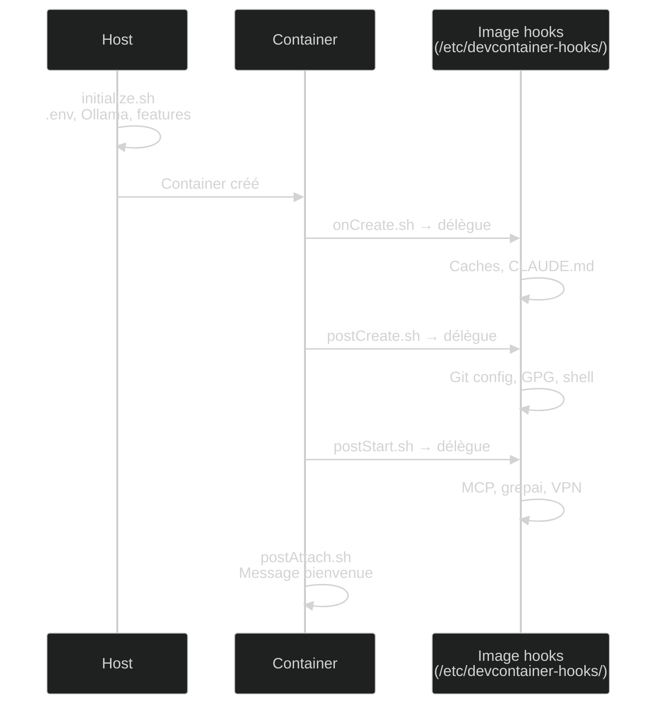

# Automatisation

Le template automatise la qualité du code via deux systèmes de hooks : les hooks DevContainer (cycle de vie du container) et les hooks Claude Code (déclenchés par les actions de Claude).

## Hooks Claude Code

Ces hooks s'exécutent automatiquement quand Claude édite un fichier ou exécute une commande. Vous n'avez rien à faire.

### Pipeline post-édition

Chaque fois que Claude écrit ou modifie un fichier :

```
Fichier modifié
    → format.sh (goimports, ruff, rustfmt, prettier...)
    → lint.sh (golangci-lint, clippy, eslint, phpstan...)
    → typecheck.sh (mypy, tsc, go vet...)
    → test.sh (pytest, go test, cargo test, jest...)
```

Chaque étape cherche d'abord un target Makefile (`make fmt`, `make lint`, `make test`), puis tombe sur l'outil du langage détecté.

### Sécurité

| Hook | Quand | Ce qu'il fait |
|------|-------|---------------|
| `pre-validate.sh` | Avant écriture | Bloque l'édition de fichiers protégés (`.devcontainer/`, `.env`, `*.lock`) |
| `security.sh` | Avant commit | Scanne les fichiers stagés pour détecter des secrets (detect-secrets, trivy, gitleaks) |
| `commit-validate.sh` | Avant commit | Bloque les messages de commit mentionnant l'IA |

!!! tip "Break glass"
    Si vous devez modifier un fichier protégé : `ALLOW_PROTECTED_EDIT=1` dans votre environnement.

### Session

| Hook | Quand | Ce qu'il fait |
|------|-------|---------------|
| `session-init.sh` | Début de session | Cache les métadonnées git (`GH_ORG`, `GH_REPO`, `GH_BRANCH`) comme variables d'env |
| `post-compact.sh` | Après compaction | Restaure les règles critiques (MCP-first, skills disponibles) dans le contexte Claude |
| `on-stop.sh` | Fin de session | Résumé de session + bell terminal |

## Hooks DevContainer (cycle de vie)

Ces hooks configurent le container. Ils utilisent un pattern de **délégation** : les scripts dans `.devcontainer/hooks/lifecycle/` appellent les vrais scripts embarqués dans l'image Docker (`/etc/devcontainer-hooks/`). Cela permet de mettre à jour les hooks en rebuilding l'image sans toucher au workspace.



| Hook | Fréquence | Actions principales |
|------|-----------|---------------------|
| `initialize.sh` | 1x (host) | Crée `.env`, valide les features, installe Ollama |
| `onCreate.sh` | 1x | Crée les répertoires de cache |
| `postCreate.sh` | 1x (gardé) | Configure git, GPG, crée `~/.devcontainer-env.sh` |
| `postStart.sh` | Chaque démarrage | Restaure Claude depuis `/etc/claude-defaults/`, génère `mcp.json`, lance grepai, connecte VPN |
| `postAttach.sh` | Chaque attach IDE | Affiche le message de bienvenue |

!!! info "Non-bloquant"
    Tous les hooks utilisent le pattern `run_step` : chaque étape s'exécute dans un subshell isolé. Un échec d'une étape n'empêche pas les suivantes.

## Serveurs MCP

6 serveurs MCP sont configurés automatiquement par `postStart.sh` à partir du template `mcp.json.tpl` :

| Serveur | Ce qu'il apporte | Auth requise |
|---------|------------------|--------------|
| **grepai** | Recherche sémantique dans le code, graphes d'appels | Aucune (local) |
| **context7** | Documentation à jour des librairies (npm, Go, Rust...) | Aucune |
| **GitHub** | Gestion des PRs, issues, branches via MCP | `GITHUB_TOKEN` |
| **GitLab** | Gestion des MRs, pipelines via MCP | `GITLAB_TOKEN` |
| **Codacy** | Analyse de qualité et sécurité du code | `CODACY_TOKEN` |
| **Playwright** | Automatisation navigateur, tests E2E | Aucune |

**Règle MCP-first** : les commandes utilisent toujours les outils MCP avant les CLI. Exemple : `/git --pr` utilise `mcp__github__create_pull_request` au lieu de `gh pr create`.
