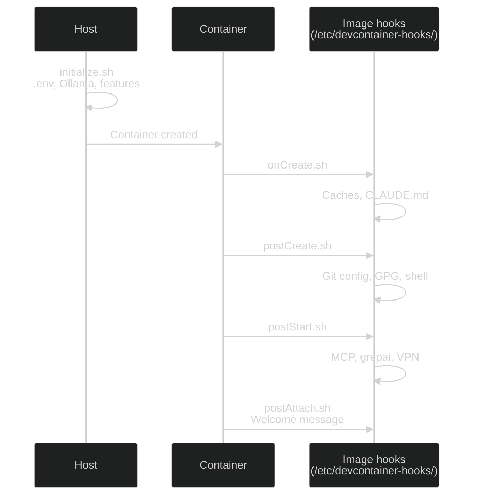

# Automation

The template automates code quality via two hook systems: DevContainer hooks (container lifecycle) and Claude Code hooks (triggered by Claude actions).

## Claude Code Hooks

These hooks run automatically when Claude edits a file or executes a command. You don't need to do anything.

### Post-Edit Pipeline

Every time Claude writes or modifies a file:

```
File modified
    → format.sh (goimports, ruff, rustfmt, prettier...)
    → lint.sh (golangci-lint, clippy, eslint, phpstan...)
    → typecheck.sh (mypy, tsc, go vet...)
    → test.sh (pytest, go test, cargo test, jest...)
```

Each step first looks for a Makefile target (`make fmt`, `make lint`, `make test`), then falls back to the detected language's tool.

### Security

| Hook | When | What It Does |
|------|------|--------------|
| `pre-validate.sh` | Before write | Blocks editing of protected files (`node_modules/`, `.git/`, `vendor/`, `dist/`, `build/`, `.env`, `*.lock`) |
| `security.sh` | Before commit | Scans staged files to detect secrets (detect-secrets, trivy, gitleaks) |
| `commit-validate.sh` | Before commit | Blocks commit messages mentioning AI |

### Session

| Hook | When | What It Does |
|------|------|--------------|
| `session-init.sh` | Session start | Caches git metadata (`GH_ORG`, `GH_REPO`, `GH_BRANCH`) as env vars |
| `post-compact.sh` | After compaction | Restores critical rules (MCP-first, available skills) in Claude context |
| `on-stop.sh` | Session end | Session summary + terminal bell |

## DevContainer Hooks (lifecycle)

These hooks configure the container. They are **embedded in the Docker image** at `/etc/devcontainer-hooks/` and called directly by `devcontainer.json`. Hooks update automatically when the image is rebuilt.


```mermaid
%%{init: {'theme': 'dark', 'themeVariables': {
  'primaryColor': '#9D76FB1a',
  'primaryBorderColor': '#9D76FB',
  'primaryTextColor': '#d4d8e0',
  'lineColor': '#d4d8e0',
  'textColor': '#d4d8e0'
}}}%%
sequenceDiagram
    participant H as Host
    participant C as Container
    participant I as Image hooks<br/>(/etc/devcontainer-hooks/)

    H->>H: initialize.sh<br/>.env, Ollama, features
    H->>C: Container created
    C->>I: onCreate.sh
    I->>I: Caches, CLAUDE.md
    C->>I: postCreate.sh
    I->>I: Git config, GPG, shell
    C->>I: postStart.sh
    I->>I: MCP, grepai, VPN
    C->>I: postAttach.sh<br/>Welcome message
```

| Hook | Frequency | Main Actions |
|------|-----------|--------------|
| `initialize.sh` | 1x (host) | Creates `.env`, validates features, installs Ollama |
| `onCreate.sh` | 1x | Creates cache directories |
| `postCreate.sh` | 1x (guarded) | Configures git, GPG, creates `~/.devcontainer-env.sh` |
| `postStart.sh` | Every start | Restores Claude from `/etc/claude-defaults/`, generates `mcp.json`, launches grepai, connects VPN, caches ZSH completions, generates dynamic p10k segments |
| `postAttach.sh` | Every IDE attach | Displays the welcome message |

!!! info "Non-blocking"
    All hooks use the `run_step` pattern: each step runs in an isolated subshell. A step failure does not prevent subsequent ones.

## MCP Servers

7 MCP servers are automatically configured by `postStart.sh` from the `mcp.json.tpl` template:

| Server | What It Provides | Auth Required |
|--------|------------------|---------------|
| **grepai** | Semantic code search, call graphs | None (local) |
| **GitHub** | PR, issue, and branch management via MCP | `GITHUB_TOKEN` |
| **GitLab** | MR and pipeline management via MCP | `GITLAB_TOKEN` |
| **context7** | Up-to-date library documentation (image fragment) | None |
| **ktn-linter** | Code linting (image fragment) | None |
| **Playwright** | Browser automation, E2E tests (browser feature) | None |

**MCP-first rule**: commands always use MCP tools before CLIs. Example: `/git --pr` uses `mcp__github__create_pull_request` instead of `gh pr create`.
