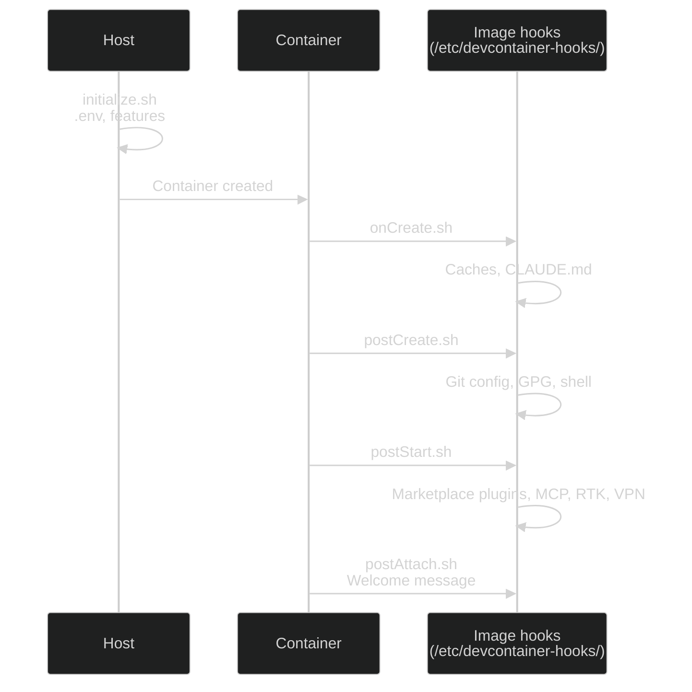

# Automation

The template automates code quality via two hook systems: DevContainer hooks (container lifecycle) and Claude Code hooks (triggered by Claude actions).

## Claude Code Hooks

These ship in the `kodflow-hooks` marketplace plugin, not in the image — `settings.json` has no `hooks` block. 15 events map to 5 scripts; hooks registered on the same event run in parallel, so each event gets exactly one script and the sequence lives inside it: gate → block → transform → observe, exiting at the first stage with nothing left to do.

| Script | Events | What It Does |
|--------|--------|---------------|
| `on-tool.sh` | PreToolUse, PostToolUse, PostToolUseFailure | Git guard (no `--no-verify`, no AI attribution or `.claude/` path in commit messages, staged-secret scan, `--force` → `--force-with-lease`), protected-path blocking (`.claude/protected-paths`), the RTK rewrite (fidelity guard for `cat`/`head`/`tail`/`sed`/`diff`/`patch`, `NO_RTK=` opt-out), post-edit formatting, project-linter pre-check, logging |
| `on-session.sh` | SessionStart, SessionEnd, PreCompact, ConfigChange | Post-compaction context restore, session log summary |
| `on-user.sh` | UserPromptSubmit, Notification | Context injection (branch, latest plan/goal), terminal bell on idle/permission prompts |
| `on-agent.sh` | SubagentStart, SubagentStop, TaskCreated, TaskCompleted, TeammateIdle | Standing rules injected into subagents, logging |
| `on-stop.sh` | Stop | Project-linter verdict over HTTP, per-directory CLAUDE.md reminder (once per directory changed this session), terminal bell |

Every log line goes through `lib/event.jq` (one sanitization policy) to `.claude/logs/<branch>/session.jsonl` (gitignored). See the plugin's README for the full event table, what was removed (auto-approving permission hooks, worktree-create/remove hooks, the `task-created.sh` contract registry) and why, and measured per-hook latencies.

### Post-Edit Formatting

Every time Claude writes or modifies a file, `on-tool.sh` (`PostToolUse`) formats it (goimports, ruff, rustfmt, prettier...), looking first for a Makefile target (`make fmt`/`make format`) then falling back to the detected language's tool. Lint, typecheck and test run at commit time, via the 7 quality scripts under `.devcontainer/images/.claude/scripts/` (`format.sh`, `lint.sh`, `typecheck.sh`, `test.sh`, `pre-commit-checks.sh`, `pre-commit-quality.sh`, `common.sh`) wired into `.githooks/pre-commit`.

## DevContainer Hooks (lifecycle)

These hooks configure the container. They are **embedded in the Docker image** at `/etc/devcontainer-hooks/` and called directly by `devcontainer.json`. Hooks update automatically when the image is rebuilt.

```mermaid
%%{init: {'theme': 'dark', 'themeVariables': {
  'primaryColor': '#9D76FB1a',
  'primaryBorderColor': '#9D76FB',
  'primaryTextColor': '#d4d8e0',
  'lineColor': '#d4d8e0',
  'textColor': '#d4d8e0'
}}}%%
sequenceDiagram
    participant H as Host
    participant C as Container
    participant I as Image hooks<br/>(/etc/devcontainer-hooks/)

    H->>H: initialize.sh<br/>.env, features
    H->>C: Container created
    C->>I: onCreate.sh
    I->>I: Caches, CLAUDE.md
    C->>I: postCreate.sh
    I->>I: Git config, GPG, shell
    C->>I: postStart.sh
    I->>I: Marketplace plugins, MCP, RTK, VPN
    C->>I: postAttach.sh<br/>Welcome message
```

| Hook | Frequency | Main Actions |
|------|-----------|--------------|
| `initialize.sh` | 1x (host) | Creates `.env`, validates features, pulls latest image |
| `onCreate.sh` | 1x | Creates cache directories |
| `postCreate.sh` | 1x (guarded) | Configures git, GPG, creates `~/.devcontainer-env.sh` |
| `postStart.sh` | Every start | Restores `scripts/`/`docs/`/`templates/`/`settings.json` from `/etc/claude-defaults/` and cleans legacy `commands/`/`agents/`/`workflows/`, registers the kodflow marketplace and installs/updates its 6 plugins (fail-open when offline — warning, cached plugins keep working), generates `mcp.json`, runs `rtk init -g --no-patch` and strips any leftover rtk hook entry from `settings.json` (the plugin owns the `PreToolUse` rewrite), connects VPN, caches ZSH completions, generates dynamic p10k segments |
| `postAttach.sh` | Every IDE attach | Displays the welcome message |

!!! info "Non-blocking"
    All hooks use the `run_step` pattern: each step runs in an isolated subshell. A step failure does not prevent subsequent ones.

## MCP Servers

5 MCP servers are assembled by `postStart.sh`: GitHub and GitLab from the `mcp.json.tpl` template, the rest merged from image fragments (`/etc/mcp/fragments/`) and feature fragments (`/etc/mcp/features/`):

| Server | What It Provides | Auth Required |
|--------|------------------|---------------|
| **GitHub** | PR, issue, and branch management via MCP | `GITHUB_TOKEN` |
| **GitLab** | MR and pipeline management via MCP | `GITLAB_TOKEN` |
| **context7** | Up-to-date library documentation (image fragment) | None |
| **ktn-linter** | Code linting (image fragment) | None |
| **Playwright** | Browser automation, E2E tests (browser feature) | None |

**MCP-first rule**: commands always use MCP tools before CLIs. Example: `/git --pr` uses `mcp__github__create_pull_request` instead of `gh pr create`.
