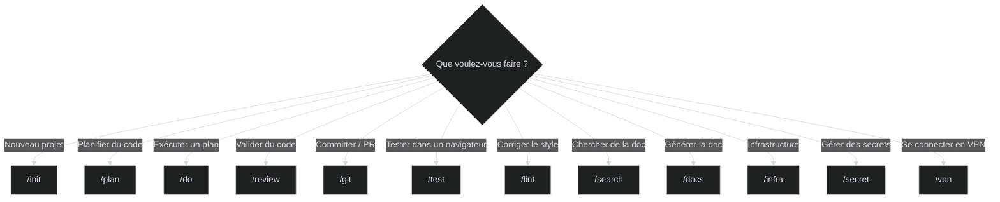

# Commandes

Les commandes (slash commands) sont le point d'entrée principal. Tapez-les directement dans Claude Code.

## Quand utiliser quelle commande

## Référence complète

### Cycle de développement

| Commande | Arguments | Ce que ça fait |
|----------|-----------|----------------|
| `/init` | — | Découverte interactive du projet, génère la doc de base (vision, architecture, workflows) |
| `/plan "desc"` | description de la tâche | Analyse le codebase, consulte les patterns, propose un plan étape par étape |
| `/do` | `--step`, `--max N` | Exécute le plan approuvé. Itère jusqu'à ce que tests + lint passent (max 50 itérations) |
| `/review` | `--pr N`, `--loop` | Lance 5 agents d'analyse en parallèle (correctness, security, design, quality, shell) |
| `/git` | `--commit`, `--push`, `--pr`, `--merge` | Branche conventionnelle, commit signé, PR via MCP GitHub |

### Qualité

| Commande | Arguments | Ce que ça fait |
|----------|-----------|----------------|
| `/lint` | `--fix` | 148 règles ktn-linter en 8 phases, corrige automatiquement |
| `/test` | `--headless`, `--trace` | Tests E2E avec Playwright MCP (navigation, screenshots, assertions) |

### Documentation & Recherche

| Commande | Arguments | Ce que ça fait |
|----------|-----------|----------------|
| `/search "query"` | requête en langage naturel | Cherche d'abord dans `~/.claude/docs/`, puis context7, puis le web |
| `/docs` | `--update`, `--stop`, `--quick` | Génère la documentation MkDocs depuis l'analyse du codebase |
| `/warmup` | `--update` | Charge la hiérarchie CLAUDE.md en mémoire, met à jour si besoin |

### Infrastructure & Ops

| Commande | Arguments | Ce que ça fait |
|----------|-----------|----------------|
| `/infra` | `--plan`, `--apply`, `--docs` | Terraform/Terragrunt : plan, apply, documentation auto |
| `/secret` | `--push KEY=val`, `--get KEY`, `--list` | Gestion de secrets via 1Password CLI (`op://vault/item`) |
| `/vpn` | `--connect`, `--disconnect`, `--list` | Connexion VPN multi-protocole depuis 1Password |

### Utilitaires

| Commande | Arguments | Ce que ça fait |
|----------|-----------|----------------|
| `/update` | `--check`, `--force` | Met à jour le devcontainer depuis le template officiel |
| `/improve` | — | Audit qualité des fichiers de patterns dans `~/.claude/docs/` |
| `/prompt` | — | Affiche le format idéal pour les descriptions de `/plan` |
