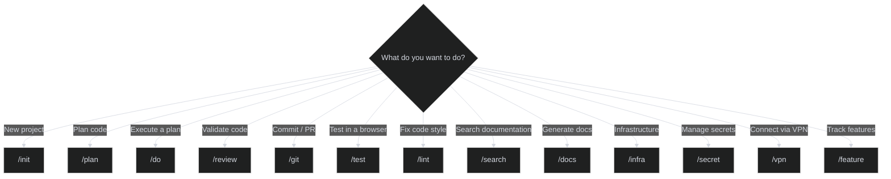

# Commands

Commands (slash commands) are the main entry point. Type them directly in Claude Code.

## When to Use Which Command

```mermaid
%%{init: {'theme': 'dark', 'themeVariables': {
  'primaryColor': '#9D76FB1a',
  'primaryBorderColor': '#9D76FB',
  'primaryTextColor': '#d4d8e0',
  'lineColor': '#d4d8e0',
  'textColor': '#d4d8e0'
}}}%%
flowchart TD
    Q{What do you want to do?}
    Q -->|New project| A["/init"]
    Q -->|Plan code| B["/plan"]
    Q -->|Execute a plan| C["/do"]
    Q -->|Validate code| D["/review"]
    Q -->|Commit / PR| E["/git"]
    Q -->|Test in a browser| F["/test"]
    Q -->|Fix code style| G["/lint"]
    Q -->|Search documentation| H["/search"]
    Q -->|Generate docs| I["/docs"]
    Q -->|Infrastructure| J["/infra"]
    Q -->|Manage secrets| K["/secret"]
    Q -->|Connect via VPN| L["/vpn"]
    Q -->|Track features| M["/feature"]
```

## Full Reference

### Development Cycle

| Command | Arguments | What It Does |
|---------|-----------|--------------|
| `/init` | — | Interactive project discovery, generates base docs (vision, architecture, workflows) |
| `/plan "desc"` | task description | Analyzes the codebase, consults patterns, proposes a step-by-step plan |
| `/do` | `--step`, `--max N` | Executes the approved plan. Iterates until tests + lint pass (max 50 iterations) |
| `/review` | `--pr N`, `--loop` | Launches 5 analysis agents in parallel (correctness, security, design, quality, shell) |
| `/git` | `--commit`, `--push`, `--pr`, `--merge` | Conventional branch, signed commit, PR via MCP GitHub |
| `/feature` | `--add`, `--edit`, `--del`, `--list`, `--checkup` | Feature tracking (RTM) with audit and auto-learn |

### Quality

| Command | Arguments | What It Does |
|---------|-----------|--------------|
| `/lint` | `--fix` | 148 ktn-linter rules in 8 phases, auto-fixes |
| `/test` | `--headless`, `--trace` | E2E tests with Playwright MCP (navigation, screenshots, assertions) |

### Documentation & Search

| Command | Arguments | What It Does |
|---------|-----------|--------------|
| `/search "query"` | natural language query | Searches first in `~/.claude/docs/`, then context7, then the web |
| `/docs` | `--update`, `--stop`, `--serve`, `--quick` | Generates MkDocs documentation from codebase analysis |
| `/warmup` | `--update` | Loads the CLAUDE.md hierarchy into memory, updates if needed |

### Infrastructure & Ops

| Command | Arguments | What It Does |
|---------|-----------|--------------|
| `/infra` | `--plan`, `--apply`, `--docs` | Terraform/Terragrunt: plan, apply, auto-documentation |
| `/secret` | `--push KEY=val`, `--get KEY`, `--list` | Secret management via 1Password CLI (`op://vault/item`) |
| `/vpn` | `--connect`, `--disconnect`, `--list` | Multi-protocol VPN connection from 1Password |

### Utilities

| Command | Arguments | What It Does |
|---------|-----------|--------------|
| `/update` | `--check`, `--force` | Updates the devcontainer from the official template |
| `/improve` | — | Quality audit for pattern files in `~/.claude/docs/` |
| `/prompt` | — | Displays the ideal format for `/plan` descriptions |
