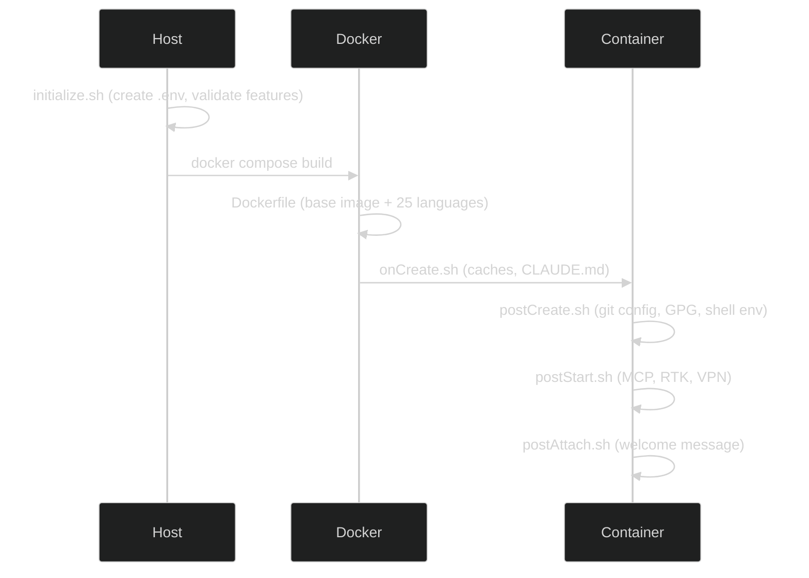

# Installation

## Installation Methods

### From the GitHub Template (recommended)

```bash
# Create a new repo from the template
gh repo create my-project --template kodflow/devcontainer-template --clone
cd my-project
code .
```

Then `Ctrl+Shift+P` → `Dev Containers: Reopen in Container`.

### In an Existing Project

```bash
# Copy the devcontainer config into your project
curl -L https://github.com/kodflow/devcontainer-template/archive/main.tar.gz | \
  tar xz --strip-components=1 -C . \
  devcontainer-template-main/.devcontainer \
  devcontainer-template-main/.claude
```

### GitHub Codespaces

Click **Code** → **Codespaces** → **Create codespace on main** in the GitHub repo. The environment builds in the cloud.

## What Happens on First Start


```mermaid
%%{init: {'theme': 'dark', 'themeVariables': {
  'primaryColor': '#9D76FB1a',
  'primaryBorderColor': '#9D76FB',
  'primaryTextColor': '#d4d8e0',
  'lineColor': '#d4d8e0',
  'textColor': '#d4d8e0'
}}}%%
sequenceDiagram
    participant H as Host
    participant D as Docker
    participant C as Container

    H->>H: initialize.sh (create .env, validate features)
    H->>D: docker compose build
    D->>D: Dockerfile (base image + 25 languages)
    D->>C: onCreate.sh (caches, CLAUDE.md)
    C->>C: postCreate.sh (git config, GPG, shell env)
    C->>C: postStart.sh (MCP, RTK, VPN)
    C->>C: postAttach.sh (welcome message)
```

| Step | Duration | What Gets Installed |
|------|----------|---------------------|
| Build image | ~5 min (first time) | Ubuntu 24.04, cloud tools, 25 languages |
| onCreate | ~10s | Cache directories |
| postCreate | ~15s | Git config, GPG, shell aliases |
| postStart | ~10s | MCP servers, RTK rewrite hook, VPN |

Subsequent starts take ~20s (the image is cached).

## Prerequisites

| Tool | Min Version | Why |
|------|-------------|-----|
| VS Code | 1.85+ | Dev Containers extension |
| Docker | 24.0+ | Container runtime |
| Git | 2.39+ | Clone, signed commits |

**Optional**:

| Tool | Why |
|------|-----|
| 1Password CLI | Secret management with `/secret` |
| GPG key | Commit signing |
