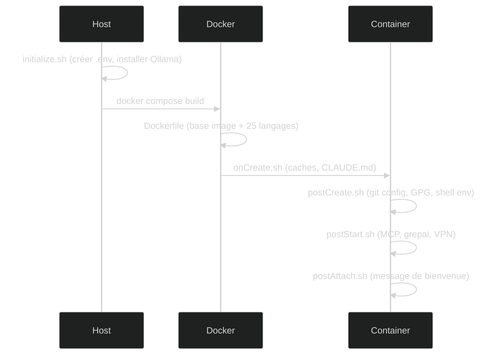

# Installation

## Méthodes d'installation

### Depuis le template GitHub (recommandé)

```bash
# Créer un nouveau repo depuis le template
gh repo create mon-projet --template kodflow/devcontainer-template --clone
cd mon-projet
code .
```

Puis `Ctrl+Shift+P` → `Dev Containers: Reopen in Container`.

### Dans un projet existant

```bash
# Copier la config devcontainer dans votre projet
curl -L https://github.com/kodflow/devcontainer-template/archive/main.tar.gz | \
  tar xz --strip-components=1 -C . \
  devcontainer-template-main/.devcontainer \
  devcontainer-template-main/.claude
```

### GitHub Codespaces

Cliquer sur **Code** → **Codespaces** → **Create codespace on main** dans le repo GitHub. L'environnement se construit dans le cloud.

## Ce qui se passe au premier démarrage



| Étape | Durée | Ce qui est installé |
|-------|-------|---------------------|
| Build image | ~5 min (1ère fois) | Ubuntu 24.04, outils cloud, 25 langages |
| onCreate | ~10s | Répertoires de cache |
| postCreate | ~15s | Git config, GPG, aliases shell |
| postStart | ~20s | MCP servers, index grepai, VPN |

Les démarrages suivants prennent ~30s (l'image est en cache).

## Prérequis

| Outil | Version min | Pourquoi |
|-------|-------------|----------|
| VS Code | 1.85+ | Extension Dev Containers |
| Docker | 24.0+ | Runtime du container |
| Git | 2.39+ | Clone, commits signés |

**Optionnel** :

| Outil | Pourquoi |
|-------|----------|
| Ollama | Recherche sémantique locale (grepai) |
| 1Password CLI | Gestion de secrets avec `/secret` |
| Clé GPG | Signature des commits |
