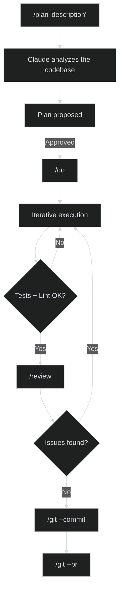

# Daily Workflow

## The Development Cycle

Every task follows the same cycle: plan, execute, validate, commit.


```mermaid
%%{init: {'theme': 'dark', 'themeVariables': {
  'primaryColor': '#9D76FB1a',
  'primaryBorderColor': '#9D76FB',
  'primaryTextColor': '#d4d8e0',
  'lineColor': '#d4d8e0',
  'textColor': '#d4d8e0'
}}}%%
flowchart TD
    A["/plan 'description'"] --> B[Claude analyzes the codebase]
    B --> C[Plan proposed]
    C -->|Approved| D["/do"]
    D --> E[Iterative execution]
    E --> F{Tests + Lint OK?}
    F -->|No| E
    F -->|Yes| G["/review"]
    G --> H{Issues found?}
    H -->|Yes| E
    H -->|No| I["/git --commit"]
    I --> J["/git --pr"]
```

## New Feature

```bash
# 1. Plan
/plan "add JWT authentication"

# 2. Validate the plan (Claude presents it, you approve or modify)

# 3. Execute
/do

# 4. Automated review (5 agents in parallel)
/review

# 5. Commit and create the PR
/git --commit
/git --pr
```

Claude automatically creates the `feat/add-jwt-auth` branch, commits in conventional format (`feat(auth): add JWT authentication`), and opens a PR.

## Fix a Bug

```bash
/plan "fix: login timeout after 30s instead of 5min"
/do
/review
/git --commit
```

Branch `fix/login-timeout`, commit `fix(auth): increase login timeout to 5 minutes`.

## Code Review

```bash
# Review local changes
/review

# Review an existing PR
/review --pr 42

# Iterative review (review → fix → re-review)
/review --loop
```

The review launches 5 parallel analyses:

| Agent | What It Looks For |
|-------|-------------------|
| Correctness | Logic bugs, off-by-one, race conditions |
| Security | Injections, hardcoded secrets, OWASP Top 10 |
| Design | SOLID violations, antipatterns, missing patterns |
| Quality | Cyclomatic complexity, dead code, duplication |
| Shell | Dangerous scripts, insecure Dockerfiles |

## Search Documentation

```bash
# Search official docs
/search "how to configure Express.js middleware"

# Search semantically in the code
# (grepai is used automatically before grep)
```

## Branch and Commit Conventions

| Type | Branch | Commit Format |
|------|--------|---------------|
| Feature | `feat/<description>` | `feat(scope): message` |
| Bug fix | `fix/<description>` | `fix(scope): message` |
| Docs | `docs/<description>` | `docs(scope): message` |
| Refactor | `refactor/<description>` | `refactor(scope): message` |

The scope is inferred from the main modified directory. Examples: `feat(auth)`, `fix(api)`, `docs(readme)`.
