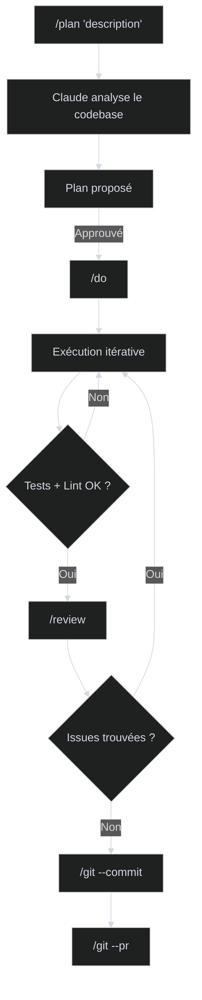

# Workflow quotidien

## Le cycle de développement

Chaque tâche suit le même cycle : planifier, exécuter, valider, committer.



## Nouvelle feature

```bash
# 1. Planifier
/plan "ajouter l'authentification JWT"

# 2. Valider le plan (Claude le présente, vous approuvez ou modifiez)

# 3. Exécuter
/do

# 4. Review automatique (5 agents en parallèle)
/review

# 5. Committer et créer la PR
/git --commit
/git --pr
```

Claude crée automatiquement la branche `feat/add-jwt-auth`, commit au format conventionnel (`feat(auth): add JWT authentication`), et ouvre une PR.

## Corriger un bug

```bash
/plan "fix: le login timeout après 30s au lieu de 5min"
/do
/review
/git --commit
```

Branche `fix/login-timeout`, commit `fix(auth): increase login timeout to 5 minutes`.

## Review de code

```bash
# Reviewer les changements locaux
/review

# Reviewer une PR existante
/review --pr 42

# Review itérative (review → fix → re-review)
/review --loop
```

La review lance 5 analyses en parallèle :

| Agent | Ce qu'il cherche |
|-------|------------------|
| Correctness | Bugs logiques, off-by-one, race conditions |
| Security | Injections, secrets hardcodés, OWASP Top 10 |
| Design | Violations SOLID, antipatterns, patterns manquants |
| Quality | Complexité cyclomatique, code mort, duplication |
| Shell | Scripts dangereux, Dockerfiles non-sécurisés |

## Rechercher de la documentation

```bash
# Chercher dans les docs officielles
/search "comment configurer les middleware Express.js"

# Chercher sémantiquement dans le code
# (grepai est utilisé automatiquement avant grep)
```

## Conventions de branches et commits

| Type | Branche | Format du commit |
|------|---------|------------------|
| Feature | `feat/<description>` | `feat(scope): message` |
| Bug fix | `fix/<description>` | `fix(scope): message` |
| Docs | `docs/<description>` | `docs(scope): message` |
| Refactor | `refactor/<description>` | `refactor(scope): message` |

Le scope est déduit du répertoire principal modifié. Exemples : `feat(auth)`, `fix(api)`, `docs(readme)`.
