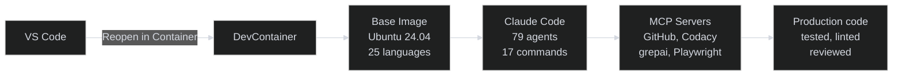

<!-- /docs-generated: {"date":"2026-03-14T00:00:00Z","commit":"edab48d","pages":14,"agents":79,"commands":17} -->
# DevContainer Template

**A complete dev environment with 79 AI agents, 17 commands, and 25 languages — ready in one command.**

[Get Started :material-arrow-right:](#quick-start){ .md-button .md-button--primary }

---

## What It Does

| Feature | Description |
|---------|-------------|
| **25 languages** | Python, Go, Rust, Node.js, Java, C/C++, Ruby, PHP, and 17 others — each with linter, formatter and tests |
| **79 AI agents** | Language specialists (25), DevOps (9), OS (22), orchestrators and executors — orchestrated by Claude Code |
| **17 commands** | `/plan`, `/do`, `/review`, `/git`, `/test`, `/lint`, `/docs`, `/feature`... cover the entire dev cycle |
| **Automatic hooks** | Format, lint, tests, secret detection — triggered on every edit |
| **7 MCP servers** | GitHub, GitLab, Codacy, Playwright, grepai, context7, Taskmaster — pre-configured auth |
| **Built-in VPN** | OpenVPN, WireGuard, IPsec, PPTP — auto-connect on startup |
| **1Password secrets** | Secure management via `/secret` with vault-like convention |

## How It Works


```mermaid
%%{init: {'theme': 'dark', 'themeVariables': {
  'primaryColor': '#9D76FB1a',
  'primaryBorderColor': '#9D76FB',
  'primaryTextColor': '#d4d8e0',
  'lineColor': '#d4d8e0',
  'textColor': '#d4d8e0'
}}}%%
flowchart LR
    A[VS Code] -->|"Reopen in Container"| B[DevContainer]
    B --> C[Base Image<br/>Ubuntu 24.04<br/>25 languages]
    C --> D[Claude Code<br/>79 agents<br/>17 commands]
    D --> E[MCP Servers<br/>GitHub, Codacy<br/>grepai, Playwright]
    E --> F[Production code<br/>tested, linted<br/>reviewed]
```

VS Code opens the DevContainer, which contains all the tools. Claude Code orchestrates the specialized agents that produce automatically validated code.

## Quick Start

**Prerequisites**: [VS Code](https://code.visualstudio.com/) + [Dev Containers extension](https://marketplace.visualstudio.com/items?itemName=ms-vscode-remote.remote-containers) + [Docker](https://docs.docker.com/get-docker/)

1. **Create a repo from the template**
    ```bash
    gh repo create my-project --template kodflow/devcontainer-template --clone
    cd my-project
    code .
    ```

2. **Open in the container**
    - `Ctrl+Shift+P` → `Dev Containers: Reopen in Container`
    - Wait for the build (~5 min the first time, ~30s after)

3. **Configure** (optional)
    - Create `.devcontainer/.env` with your tokens:
    ```env
    GIT_USER=YourName
    GIT_EMAIL=your@email.com
    GITHUB_TOKEN=ghp_xxx
    ```

4. **Start working**
    ```
    /warmup              # Load project context
    /plan "my feature"   # Plan the implementation
    /do                  # Execute the plan
    /git --commit        # Commit properly
    ```

---

DevContainer Template · MIT · [GitHub](https://github.com/kodflow/devcontainer-template)
