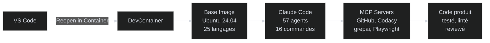

<!-- /docs-generated: {"date":"2026-02-19T21:05:00Z","commit":"ffd5c95","pages":14,"agents":9} -->
# DevContainer Template

**Un environnement de dev complet avec 57 agents IA, 16 commandes, et 25 langages — prêt en une commande.**

[Commencer :material-arrow-right:](#quick-start){ .md-button .md-button--primary }

---

## Ce que ça fait

| Fonctionnalité | Description |
|----------------|-------------|
| **25 langages** | Python, Go, Rust, Node.js, Java, C/C++, Ruby, PHP, et 17 autres — chacun avec linter, formatter et tests |
| **57 agents IA** | Spécialistes par langage, DevOps, sécurité, architecture — orchestrés par Claude Code |
| **16 commandes** | `/plan`, `/do`, `/review`, `/git`, `/test`, `/lint`, `/docs`... couvrent tout le cycle de dev |
| **Hooks automatiques** | Format, lint, tests, détection de secrets — déclenchés à chaque édition |
| **6 serveurs MCP** | GitHub, GitLab, Codacy, Playwright, grepai, context7 — auth pré-configurée |
| **VPN intégré** | OpenVPN, WireGuard, IPsec, PPTP — connexion auto au démarrage |
| **Secrets 1Password** | Gestion sécurisée via `/secret` avec convention vault-like |

## Comment ça marche



VS Code ouvre le DevContainer, qui contient tous les outils. Claude Code orchestre les agents spécialisés qui produisent du code validé automatiquement.

## Quick Start

**Prérequis** : [VS Code](https://code.visualstudio.com/) + [Dev Containers extension](https://marketplace.visualstudio.com/items?itemName=ms-vscode-remote.remote-containers) + [Docker](https://docs.docker.com/get-docker/)

1. **Créer un repo depuis le template**
    ```bash
    gh repo create mon-projet --template kodflow/devcontainer-template --clone
    cd mon-projet
    code .
    ```

2. **Ouvrir dans le container**
    - `Ctrl+Shift+P` → `Dev Containers: Reopen in Container`
    - Attendre le build (~5 min la première fois, ~30s ensuite)

3. **Configurer** (optionnel)
    - Créer `.devcontainer/.env` avec vos tokens :
    ```env
    GIT_USER=VotreNom
    GIT_EMAIL=votre@email.com
    GITHUB_TOKEN=ghp_xxx
    ```

4. **Commencer à travailler**
    ```
    /warmup              # Charger le contexte projet
    /plan "ma feature"   # Planifier l'implémentation
    /do                  # Exécuter le plan
    /git --commit        # Committer proprement
    ```

---

DevContainer Template · MIT · [GitHub](https://github.com/kodflow/devcontainer-template)
